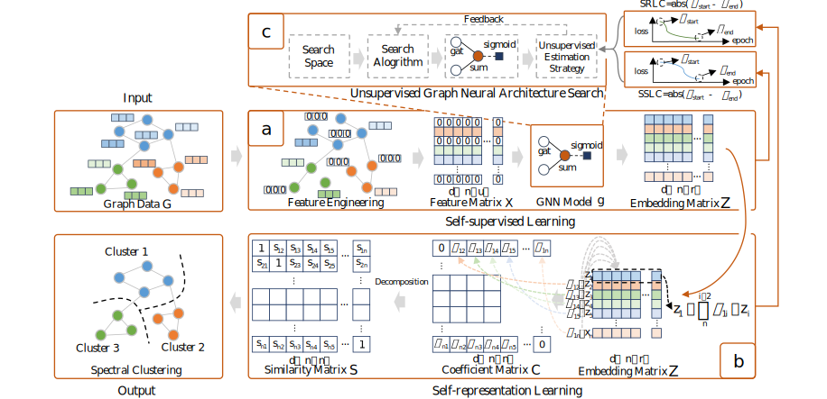

# CommGNAS

- CommGNAS is an unsupervised automatic graph representation learning framework based on self-supervised and self-representation learning.

- The framework of CommGNAS is as follows:

<br>
<div align=left>  </div>

## News

- 2023.04.28 Our work [*CommGNAS: Unsupervised Graph Neural Architecture Search for Community Detection.*](https://ieeexplore.ieee.org/document/10112632) is accepted by **TETC 2023**.


  
## Installing For Ubuntu 16.04

- **Ensure you have installed CUDA 10.2 before installing other packages**

**1. Nvidia and CUDA 10.2:**

```python
[Nvidia Driver] 
https://www.nvidia.cn/Download/index.aspx?lang=cn

[CUDA 10.2 Download and install command] 
#download:
wget https://developer.download.nvidia.com/compute/cuda/10.2/Prod/local_installers/cuda_10.2.89_440.33.01_linux.run
#install:
sudo sh cuda_10.2.89_440.33.01_linux.run

```

**2. Python environment:** recommending using Conda package manager to install

```python
conda create -n commgnas python=3.7
source activate commgnas
```

**3. Pytorch 1.8.1:** execute the following command in your conda env automsr

```python
pip install torch==1.8.1+cu102 torchvision==0.9.1+cu102 torchaudio==0.8.1 -f https://download.pytorch.org/whl/torch_stable.html
```

**4. Pytorch Geometric 2.0.2:** execute the following command in your conda env automsr
```python
pip install torch-scatter==2.0.9 torch-sparse==0.6.12 torch-cluster==1.5.9 torch-spline-conv==1.2.1 torch-geometric==2.0.2 -f https://data.pyg.org/whl/torch-1.8.0+cu102.html
```
**5. Ray 1.7.0:** execute the following command in your conda env automsr
```python
pip install ray==1.7.0
```


## Running the Experiment
**1.Searching the GNN Architecture for Community Detection**
```python
python search_main.py
```

**2.Testing the Optimal Model Designed by CommGNAS for Community Detection**
```python
python test_main.py
```

## Citing

If you think AutoMSR is useful tool for you, please cite our paper, thank you for your support:
```python
@ARTICLE{10112632,
  author={Gao, Jianliang and Chen, Jiamin and Oloulade, Babatounde Moctard and Al-Sabri, Raeed and Lyu, Tengfei and Zhang, Ji and Li, Zhao},
  journal={IEEE Transactions on Emerging Topics in Computing}, 
  title={CommGNAS: Unsupervised Graph Neural Architecture Search for Community Detection}, 
  year={2023},
  volume={},
  number={},
  pages={1-12},
  doi={10.1109/TETC.2023.3270181}}
```
